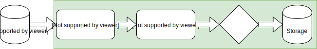
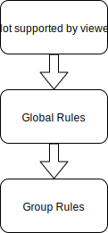

# Overview

Rules are how the syslog messages are turned into console events. Rules are where you can discard, deduplicate or modify the events that appear in you console. 

Events are received from an external source, are processed by user defined rules and stored on the Panther server.

## Processing order

Firstly there is a set of [Syslog Mappings](/rules/syslog#syslog-mappings) that are applied to every event.

Then Global Rules are processed, one by one.

Then an event can be optionally sorted into a single *Group* and that Groups Rules are processed, one by one.

## Monitor specific rules

Each monitor can have specific rules which help translate them into a standard panther event.

There are two monitors with specific rules

 - [HTTP](/rules/http)
 - [syslog](/rules/syslog)
