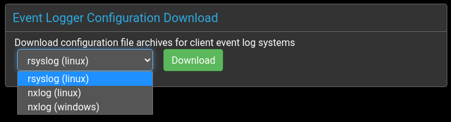

# NXLog Configuration (Linux)

Install the NXLog Community Edition
[from the official website](https://nxlog.co/products/nxlog-community-edition/download){:target="_blank"}
following
[the deployment guide.](https://nxlog.co/documentation/nxlog-user-guide/deployment.html){:target="_blank"}

Once installed, the steps to integrate NXLog with Panther are:

 * [download the configuration archive](#download-linux-configuration-archive)
 * [install configuration files](#install-configuration-files-on-linux)
 * [restart nxlog](#restart-nxlog-on-linux)

## Download Linux Configuration Archive

The configuration archives are available on the `Admin` page. Select this using the tab from the main menu at the top of the Panther page.


The drop-down selector offers archives for the supported software and operating systems.



Select the appropriate option for your client and click the `Download` button.

The archives are downloaded in an appropriate format for each system:

- Linux archives are provided in uncompressed `tar` format, while
- Windows archives are built using `zip`.

> _**NOTE**: that the same certificates and keys are provided in each archive, so for custom configurations the choice of download is unimportant._


## Install configuration files on Linux

To begin with, download the configuration archive
[as described above.](#download-configuration-archive)
The downloaded resources in `nxlog-config-linux.tar` then need to be
installed into the system NXLog configuration directory.

The following commands will extract the archive into `/etc/nxlog`,
which should have been created during the NXLog installation.  Note
that any existing `nxlog.conf` will be overwritten, so make a backup
if one already exists.

```console
[root@localhost ~]# cd /etc/nxlog
[root@localhost /etc/nxlog]# tar -xvf /path/to/nxlog-config-linux.tar
```

Apart from overwriting the main `nxlog.conf`, this will extract the
required certificates and key files into a new `panther` sub-directory.


## Restart NXLog on Linux

If NXLog has been installed according to
[the deployment guide,](https://nxlog.co/documentation/nxlog-user-guide/deployment.html){:target="_blank"}
then it should restart automatically following a system reboot.

In order to have the new configuration take immediate effect, it is
also possible to restart NXLog immediately. While systemd systems such
as Ubuntu and CentOS are supported, at the time of writing the service
management interface for NXLog is implemented as a wrapper around the
System V init scripts.

This means that, on both systemd and init based systems, it is
possible to restart NXLog by calling the init script directly:

```console
[root@localhost /etc/nxlog]# /etc/init.d/nxlog restart
```

# NXLog Configuration (Windows)

Download the Windows installer for the NXLog Community Edition
[from the official website.](https://nxlog.co/products/nxlog-community-edition/download){:target="_blank"}

Install the package by running the installer, but also see
[the deployment guide.](https://nxlog.co/documentation/nxlog-user-guide/deployment.html){:target="_blank"}

Once installed, the steps to integrate NXLog with Panther are:

 * [download configuration archive](#download-windows-configuration-archive)
 * [install configuration files](#install-configuration-files-on-windows)
 * [restart nxlog](#restart-nxlog-on-windows)

## Download Windows Configuration Archive

__TODO__


## Install configuration files on Windows

Once the Windows configuration archive has been downloaded
[as described above,](#download-configuration-archive) the contents of
`nxlog-config-windows.zip` must be overlaid onto the base directory of
the installed NXLog package.  If the default install options were
used, this will normally be:

  `C:\Program Files (x86)\nxlog`.

Opening this directory with the Windows File Explorer will show that it
contains `cert` and `conf` sub-directories, among others. While the
`cert` directory should be empty, the `conf` directory may contain a
sample `nxlog.conf`, which should be renamed `nxlog.dist` in order to
prevent any clash with the new configuration.

Extract the downloaded `nxlog-config-windows.zip` Panther
configuration archive by clicking on it and selecting the `extract to`
option, specifying the base directory NXLog was installed into --
normally `C:\Program Files\nxlog` -- containing the `cert` and `conf`
sub-directories.

This will copy the certificates and key files into the empty `cert`
directory, along with a new `nxlog.conf` into the `conf`
directory. Note that the system may ask for confirmation when writing
to the `cert` directory, owing to its permissions.


## Restart NXLog on Windows

The NXLog installer should have configured the service to be started
automatically on the next system boot.

From the NXLog documentation, it is also possible to start the service
directly from the services console, or from the command line interface
by navigating to the install directory and running `nxlog.exe -f`.
This last option may assist in initial debugging.
