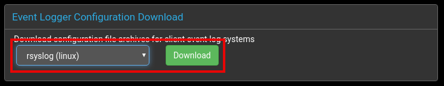

# Rsyslog Configuration

For complete information on configuring [rsyslog](https://www.rsyslog.com/){:target="_blank"},
please consult the official [guides for rsyslog.](https://www.rsyslog.com/category/guides-for-rsyslog/){:target="_blank"}

Major distributions include rsyslog in their standard repositories, so
please either follow your system's guidelines to install and enable
it, or [visit the official website.](https://www.rsyslog.com/){:target="_blank"}

Once rsyslog is installed, the necessary steps to integrate it with
Panther are:

 * [download the configuration archive](#downloading-configuration-archive)
 * [install supporting gnutls packages](#install-gnu-tls-support-for-rsyslog)
 * [install configuration files](#install-the-configuration-files)
 * [restart rsyslog](#restart-rsyslog)


## Downloading Configuration Archive 

The configuration archives are available on the `Admin` page. Select this using the tab from the main menu at the top of the Panther page.


The drop-down selector offers archives for the supported software and operating systems.



Select the appropriate option for your client and click the `Download` button.

The archives are downloaded in an appropriate format for each system:

- Linux archives are provided in uncompressed `tar` format, while
- Windows archives are built using `zip`.

> _**NOTE**: that the same certificates and keys are provided in each archive, so for custom configurations the choice of download is unimportant._


## Install GNU-TLS support for rsyslog

On GNU/Linux systems, rsyslog uses [the GnuTLS](https://gnutls.org/){:target="_blank"}
library to provide its TLS functionality. This is classed as an
optional dependency on some distributions, and is therefore not always
installed automatically by the package manager. Where this is the
case, the TLS package may have to be added explicitly along with the
main rsyslog package.

### Debian / Ubuntu

```console
# apt-get install rsyslog-gnutls
```

### RedHat / CentOS

```console
# yum install rsyslog-gnutls
```

## Install the configuration files

The downloaded resources in `rsyslog-config-linux.tar` need to be
installed into the system rsyslog configuration directory.

The following commands will extract the archive into
`/etc/rsyslog-client.d`, creating it if necessary. If the directory
already exists, then make a backup of it before extracting the archive
in case any previously configured files are overwritten.

```console
[root@localhost ~]# cd /etc
[root@localhost /etc]# tar -xvf /path/to/rsyslog-config-linux.tar
```

## Edit the main rsyslog configuration

Once the new configuration files have been installed, the main system
rsyslog configuration file must be updated in order to reference them.

Edit `/etc/rsyslog.conf` and make sure that it contains a line like
this to read the Panther configuration files extracted from the
archive above:

```console
$IncludeConfig /etc/rsyslog-client.d/*.conf
```

## Restart rsyslog

The new configuration should take effect automatically when the system
is next rebooted, but it is also possible to restart rsyslog to
have the changes take effect immediately.

### systemd based systems

Systems using the newer systemd service manager, such as Ubuntu 18 and CentOS 7, can restart the rsyslog service as follows:

```console
# systemctl restart rsyslog
```

### init.d based systems

Systems using the older System V init service management scripts can generally restart the rsyslog service as follows:

```console
# /etc/init.d/rsyslog restart
```

